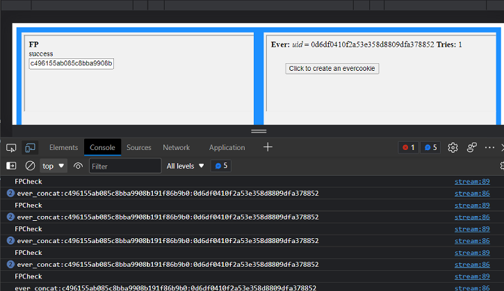

## Ever
Store cookie in many different ways to track players and/or send persistent messages across multiple casino's.

This is a personal little package, so use however you wish but expect nothing as it's specific to be for casino.

## Messages
This is to be embedded in 0/1px iframes within a page. It will then stream the user data whatever you wish through postMessage(), simply add eventListener to parent page.

It also sets the key:value within the page title, so you can make a check in parent page for the page title.

You can set this in google-analytics/googletagmanager probably and this way actually get shared cross domain messaging.

Personally I think I will use the page title for persistent key (like finger printing) and then postMessage for additional messages that you may want to 'sneak' in to the front user without them realizing.

Messages is send in postMessage() function.

## PHP Class
For PNG image method, digest/auth method and cache eTag requires PHP backend. Is to be implemented for auth.

The laravel class that I use I've put in this repository, but probably you should mix this with regular sanctum/JWT authed messages to spot multi user.

## Browser Storage Mechanisms

Client browsers must support as many of the following storage mechanisms as
possible in order for Evercookie to be effective.

- Standard [HTTP Cookies](https://en.wikipedia.org/wiki/HTTP_cookie)
- Flash [Local Shared Objects](https://en.wikipedia.org/wiki/Local_Shared_Object)
- Silverlight [Isolated Storage](http://www.silverlight.net/learn/quickstarts/isolatedstorage/)
- CSS [History Knocking](https://samy.pl/csshack/)
- Storing cookies in [HTTP ETags](https://en.wikipedia.org/wiki/HTTP_ETag) ([Backend server](#backend-server) required)
- Storing cookies in [Web cache](https://en.wikipedia.org/wiki/Web_cache) ([Backend server](#backend-server) required)
- [HTTP Strict Transport Security (HSTS)](https://sites.google.com/a/chromium.org/dev/Home/chromium-security/client-identification-mechanisms#TOC-Lower-level-protocol-identifiers) Pinning (works in Incognito mode)
- [window.name caching](https://en.wikipedia.org/wiki/HTTP_cookie#window.name)
- Internet Explorer [userData storage](http://msdn.microsoft.com/en-us/library/ms531424.aspx)
- HTML5 [Session Storage](http://dev.w3.org/html5/webstorage/#the-sessionstorage-attribute)
- HTML5 [Local Storage](http://dev.w3.org/html5/webstorage/#dom-localstorage)
- HTML5 [Global Storage](https://developer.mozilla.org/en/dom/storage#globalStorage)
- HTML5 [Database Storage via SQLite](http://dev.w3.org/html5/webdatabase/)
- HTML5 Canvas - Cookie values stored in RGB data of auto-generated, force-cached PNG images ([Backend server](#backend-server) required)
- HTML5 [IndexedDB](http://www.w3.org/TR/IndexedDB/)
- Java [JNLP PersistenceService](http://docs.oracle.com/javase/1.5.0/docs/guide/javaws/jnlp/index.html)
- Java exploit [CVE-2013-0422](https://cve.mitre.org/cgi-bin/cvename.cgi?name=CVE-2013-0422) - Attempts to escape the applet sandbox and write cookie data directly to the user's hard drive.

To be implemented someday (perhaps by you?):

- [TLS Session Resumption](https://www.ietf.org/rfc/rfc5077.txt) Identifiers/Tickets (works in Incognito mode)
- Generating [HTTP Public Key Pinning (HPKP)](https://www.wikiwand.com/en/HTTP_Public_Key_Pinning) certificates per user
- Caching in [HTTP Authentication](https://en.wikipedia.org/wiki/Basic_access_authentication)
- Google Gears
- Using Java to produce a unique key based off of NIC info
- Other methods? Please comment!

s